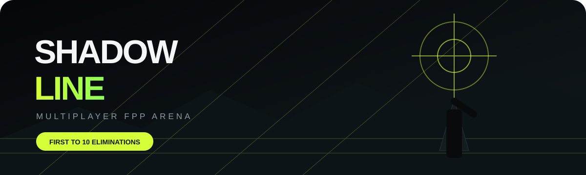
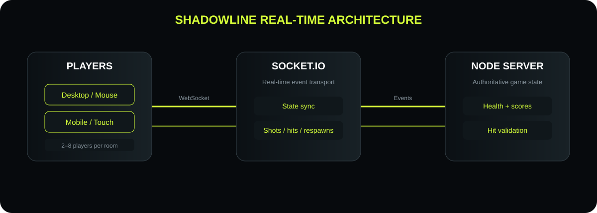

# 🎯 SHADOWLINE — Multiplayer FPP Arena

<p align="center">
  
</p>

<p align="center">
  <strong>A real-time, cross-device first-person multiplayer marksman arena built for the browser.</strong>
</p>

<p align="center">
  
  
  
  
</p>

---

## 🕶️ What is SHADOWLINE?

**SHADOWLINE** is a browser-based multiplayer FPP arena where players join the same room from different devices, move through a 3D arena, aim, fire, score eliminations, and respawn.

It is designed around a simple goal:

> **Open the URL → create/join a room → share the code → play.**

No client installation is required.

<p align="center">
  
</p>

---

## ✨ Features

| Feature | Details |
|---|---|
| 🌐 Cross-device | Desktop and mobile browsers can join the same room |
| 👥 Multiplayer | 2–8 players per room |
| 🔑 Room codes | Create a private match with a 5-character code |
| ⚡ Real-time | Socket.IO synchronizes player state and combat events |
| 🎯 FPP | First-person 3D camera using Three.js/WebGL |
| 🏆 Match objective | First player to reach **10 eliminations** wins |
| 💥 Combat rules | Body hit = **34 damage**, headshot = **instant elimination** |
| 🔄 Respawn | Eliminated players return after **2.5 seconds** |
| 🛡️ Server authority | Health, scores, cooldowns and hit validation are handled server-side |
| 📱 Mobile controls | Virtual movement stick + fire button |
| 🖥️ Desktop controls | WASD + mouse + click |
| 🏟️ Arena | Cover blocks, boundaries, lighting and fog |
| 📊 HUD | Health, room code, live scoreboard, crosshair and kill feed |

---

## 🎮 Game Rules

The rules are visible in the lobby so a player can understand the objective without a separate explanation.

### Objective

**First player to 10 eliminations wins the match.**

### Damage

```text
BODY HIT       → 34 HP
HEADSHOT       → 100 HP / instant elimination
MAX HEALTH     → 100 HP
RESPAWN        → 2.5 seconds
WIN CONDITION  → 10 eliminations
```

### Match flow

1. Create or join a room.
2. Wait for another player.
3. Move and aim around the arena.
4. Fire at opponents.
5. Valid hits reduce the target's health.
6. An eliminated player disappears temporarily.
7. The player respawns after 2.5 seconds.
8. The first player to reach 10 eliminations wins.

---

## 🧱 Architecture

<p align="center">
  
</p>

The architecture separates the browser rendering layer from the authoritative multiplayer state:

```text
┌──────────────────────┐
│   PLAYER BROWSER     │
│  Three.js + WebGL    │
│  Mouse / Touch       │
└──────────┬───────────┘
           │
           │ Socket.IO
           ▼
┌──────────────────────┐
│    NODE.JS SERVER    │
│                      │
│  Room management     │
│  Player state        │
│  Health / scoring    │
│  Fire cooldown       │
│  Hit validation      │
│  Respawn             │
└──────────┬───────────┘
           │
           │ Socket.IO
           ▼
┌──────────────────────┐
│   OTHER PLAYERS      │
│  Desktop / Mobile    │
└──────────────────────┘
```

### Why server authority?

The server owns important game values rather than trusting the browser:

- Player health
- Player score
- Fire cooldown
- Hit detection
- Eliminations
- Respawns
- Victory condition

This makes the prototype much harder to manipulate by simply changing client-side values.

---

## 🛠️ Technology Stack

### Frontend

- **Three.js** — 3D rendering and first-person camera
- **WebGL** — browser graphics
- **HTML5**
- **CSS3**
- **JavaScript ES Modules**

### Multiplayer

- **Socket.IO**
- WebSockets with polling fallback
- Room-based communication

### Backend

- **Node.js**
- **Express**
- In-memory room/game state

---

## 📁 Project Structure

```text
shadowline-fpp/
│
├── 📄 package.json
├── 📄 server.js
├── 📄 README.md
│
├── 📁 public/
│   ├── 🌐 index.html
│   ├── 🎨 style.css
│   └── 🎮 game.js
│
└── 📁 assets/
    ├── 🖼️ shadowline-banner.svg
    ├── 🖼️ architecture.svg
    └── 🖼️ match-loop.svg
```

---

## 🚀 Run Locally

### 1. Requirements

Install:

- Node.js **18 or newer**
- npm

Check:

```bash
node --version
npm --version
```

### 2. Install dependencies

From the project directory:

```bash
npm install
```

### 3. Start the server

```bash
npm start
```

You should see:

```text
Shadowline FPP running on port 3000
```

### 4. Open the game

Go to:

```text
http://localhost:3000
```

---

## 📱 Test With Two Devices

### Same Wi-Fi

Find your computer's local IP.

On Windows:

```powershell
ipconfig
```

Look for:

```text
IPv4 Address
```

For example:

```text
192.168.1.10
```

Then open this on the second device:

```text
http://192.168.1.10:3000
```

### Example

```text
Laptop
   │
   │  Create Room
   ▼
  AB7KQ
   ▲
   │  Join Room
   │
Phone
```

Both players should now appear in the same arena.

> If the second device cannot connect, Windows Firewall may be blocking Node.js on port `3000`. Allow Node.js through the private-network firewall when prompted.

---

## 🎮 Controls

### 🖥️ Desktop

| Action | Control |
|---|---|
| Move forward | `W` |
| Move backward | `S` |
| Strafe left | `A` |
| Strafe right | `D` |
| Look | Mouse |
| Fire | Left click |

### 📱 Mobile

| Action | Control |
|---|---|
| Move | Left virtual joystick |
| Look | Drag/swipe the right side of the screen |
| Fire | FIRE button (tap or hold) |

The interface automatically adapts to smaller screens.

---

## 🌍 Deploying to a Public URL

The server is designed to run as a normal Node.js web service.

A compatible host should provide:

```text
Build / Install:
npm install

Start:
npm start
```

The server automatically reads:

```js
process.env.PORT
```

so the hosting platform can assign its own port.

### Deployment flow

```text
GitHub Repository
       │
       ▼
Node.js Hosting
       │
       ▼
Public HTTPS URL
       │
       ├──────── Player A
       │
       ├──────── Player B
       │
       └──────── Player C
```

For production deployment, use a host that supports **long-lived WebSocket connections**.

---

## 🔐 Multiplayer Event Model

The main real-time events are:

```text
CLIENT → SERVER

createRoom
joinRoom
state
shoot


SERVER → CLIENT

world
shot
hitConfirm
elimination
matchOver
```

### State synchronization

The browser periodically sends:

```text
position
rotation
pitch
```

The server broadcasts the authoritative world state to the room.

### Shooting

A shot includes the player's view direction. The server:

1. Checks that the player exists.
2. Checks that the player is alive.
3. Enforces the fire cooldown.
4. Builds a shot ray.
5. Checks opponents.
6. Determines whether the shot hits.
7. Applies damage.
8. Updates score.
9. Handles elimination/respawn.
10. Broadcasts the updated state.

---

## 🧪 Testing Checklist

Before calling a deployment complete:

- [ ] Two different devices can open the URL.
- [ ] Player A can create a room.
- [ ] Player B can join using the room code.
- [ ] Both players see each other.
- [ ] Movement synchronizes.
- [ ] Shooting synchronizes.
- [ ] Health changes correctly.
- [ ] Eliminations increment the correct score.
- [ ] Respawn works.
- [ ] First player to 10 wins.
- [ ] Mobile controls work.
- [ ] Refresh/reconnect behavior is acceptable.
- [ ] HTTPS/WSS works on the deployed host.

---

## ⚠️ Current Prototype Limitations

This project intentionally keeps the backend lightweight.

### In-memory rooms

Rooms exist in server memory:

```text
Server restart → rooms reset
```

For a larger production game, use persistent/session infrastructure such as Redis or a database.

### Basic collision model

The current prototype uses simple arena boundaries and cover geometry. It is not a full FPS physics engine.

### Browser networking

Internet play depends on the hosting platform allowing WebSocket connections and maintaining the Node.js process.

---

## 🔮 Future Upgrades

Potential next versions could add:

- 🔫 Multiple weapons
- 🎯 Sniper scope / zoom
- 🧱 Proper collision and cover detection
- 🗺️ Multiple maps
- 👥 Teams
- 💬 In-game chat
- 🔊 Gunshots and hit sounds
- 🎵 Background audio
- 🏅 Matchmaking
- 👤 Player profiles
- 💾 Persistent statistics
- 🏆 Leaderboards
- 🔐 Authentication
- 🧰 Admin/moderation tools
- 🚀 Dedicated game servers
- 📈 Redis-based state scaling
- 🎥 Spectator mode
- 🕹️ Gamepad support

---

## 📜 License

This project is intended as a learning/portfolio multiplayer game prototype.

Add your preferred open-source license before publishing the repository publicly.

---

<p align="center">
  <strong>SHADOWLINE</strong><br>
  <sub>Acquire the target. Hold the line. Reach ten.</sub>
</p>
